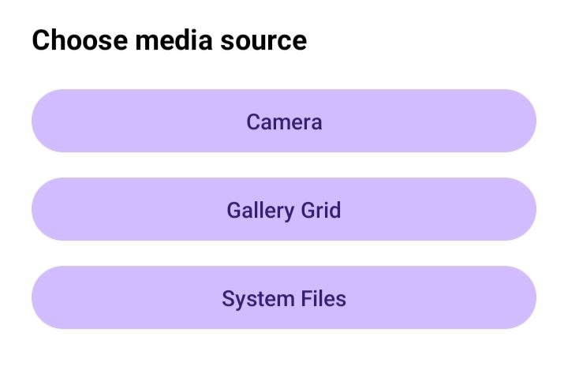
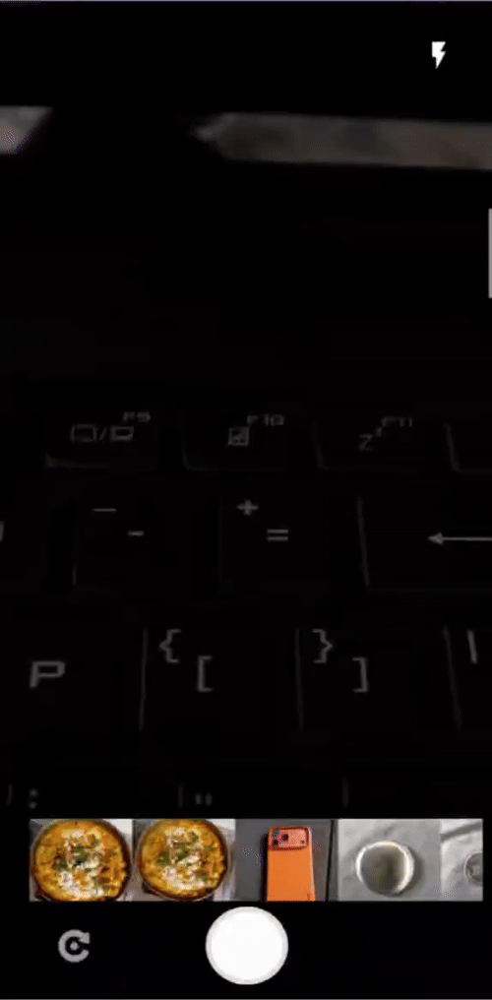

# MediaSnap Library
 
[](https://kotlinlang.org/)
[](LICENSE)
[](#)

---
**MediaSnap — Media Picker for Android (Camera + Gallery + Video)**

MediaSnap is a modern, fully customizable Android Media Picker library.

## Preview



## Demo



---

## It supports:
✅ CameraX Photo Capture

✅ Document Selection

✅ Long-Press Video Recording

✅ Gallery Grid Selection

✅ Multi-Select with Limits

✅ Full-Screen Preview

✅ Video Duration & Play Icon

✅ Custom UI Theme

✅ Result Callback & Activity Redirection

✅ JitPack Ready

---

## Installation

**1️⃣ Add JitPack to settings.gradle**
```
dependencyResolutionManagement {
    repositories {
        mavenCentral()
        google()
        maven { url 'https://jitpack.io' }
    }
}
```
**2️⃣ Add Dependency**
```
dependencies {
    implementation("com.github.Excelsior-Technologies-Community:MediaSnap:1.0.1")
}
```
---
## Permissions (Required)

**Add this to your AndroidManifest.xml:**
```
<uses-permission android:name="android.permission.CAMERA"/>
<uses-permission android:name="android.permission.RECORD_AUDIO"/>

<!-- Android 13+ -->
<uses-permission android:name="android.permission.READ_MEDIA_IMAGES"/>
<uses-permission android:name="android.permission.READ_MEDIA_VIDEO"/>

<!-- Android 12 and below -->
<uses-permission
    android:name="android.permission.READ_EXTERNAL_STORAGE"
    android:maxSdkVersion="32"/>
```
---
## Basic Usage

Add The Code below to your **Kotlin File**
```
MediaSnap.with(this)
    .images()
    .videos()
    .camera()
    .maxSelection(5)
    .setGridSpanCount(3)
    .enablePreview(true)
    .enableCameraX(true)
    .setTheme(MediaSnapTheme.default())
    .start { uris ->
        Log.d("MediaSnap", "Final Selected URIs: $uris")
    }

    //Example
    private val permissionLauncher =
        registerForActivityResult(ActivityResultContracts.RequestMultiplePermissions()) { result ->

            val cameraGranted = result[Manifest.permission.CAMERA] == true
            val audioGranted = result[Manifest.permission.RECORD_AUDIO] == true

            if (cameraGranted) {
                openMediaSnap()   //Open even if audio denied (video will be silent)
            } else {
                Toast.makeText(this, "Camera permission required", Toast.LENGTH_SHORT).show()
            }
        }

        override fun onCreate(savedInstanceState: Bundle?) {
        super.onCreate(savedInstanceState)
        setContentView(R.layout.activity_main)

        findViewById<Button>(R.id.btnOpenMediaSnap).setOnClickListener {

            val cameraOk = ContextCompat.checkSelfPermission(
                this,
                Manifest.permission.CAMERA
            ) == PackageManager.PERMISSION_GRANTED

            val audioOk = ContextCompat.checkSelfPermission(
                this,
                Manifest.permission.RECORD_AUDIO
            ) == PackageManager.PERMISSION_GRANTED

            if (cameraOk && audioOk) {
                openMediaSnap()
            } else {
                //Request both permissions safely
                permissionLauncher.launch(
                    arrayOf(
                        Manifest.permission.CAMERA,
                        Manifest.permission.RECORD_AUDIO
                    )
                )
            }
        }
    }

    // OPEN MEDIASNAP ONLY AFTER PERMISSION IS GRANTED
    private fun openMediaSnap() {
        MediaSnap.with(this)
            .images()
            .videos()
            .camera()
            .maxSelection(5)
            .setGridSpanCount(3)
            .enablePreview(true)
            .enableCameraX(true)
            .setTheme(MediaSnapTheme.default())
            .start { uris ->
                Log.d("MediaSnap", "Final Selected URIs: $uris")
            }
    }
```
---
## ⚙️ Configuration Options

| Method | Description |
|--------|-------------|
| `.images()` | Enables image selection |
| `.videos()` | Enables video selection |
| `.camera()` | Enables CameraX capture |
| `.maxSelection(5)` | Limits the maximum selected media count |
| `.setGridSpanCount(3)` | Sets gallery grid column count |
| `.enablePreview(true)` | Enables full-screen media preview |
| `.enableCameraX(true)` | Enables CameraX engine |
| `.setTheme(theme)` | Applies custom UI theme |
| `.start { uris -> }` | Receives final selected media URIs |
---

## Custom Theme Support

Add The code in your **Kotlin File**
```
val customTheme = MediaSnapTheme(
    primaryColor = 0xFF000000.toInt(),
    accentColor = 0xFFFFFFFF.toInt(),
    checkmarkColor = 0xFFFFC107.toInt(),
    sendButtonColor = 0xFF2196F3.toInt()
)

MediaSnap.with(this)
    .setTheme(customTheme)
    .start { uris -> }
```
---
**Send Result to Another Activity Automatically**
```
MediaSnap.with(this)
    .setResultDestination(UploadActivity::class.java)
    .start { }
```
**Receive in your activity:**
```
val uris = intent.getParcelableArrayListExtra<Uri>("media_result")
```
---
## Camera Features

✅ Tap → Photo Capture

✅ Long-Press → Video Recording

✅ Release → Stop Recording

✅ Timer Display During Recording

✅ Flash Toggle

✅ Front / Back Camera Switch

✅ Live Recent Gallery Strip

---
## Custom Bottom Sheet Layout Support

**You can completely replace:**
```
res/layout/bottom_sheet_mediasnap.xml
```

---

## 🎨 Custom Layout Support (Important)

MediaSnap allows you to use **your own fully custom layouts** (for BottomSheet, Camera, Preview, etc).  
However, to ensure everything works correctly, **you MUST keep the required view IDs unchanged**.

You are free to:
- Change icons ✅  
- Change colors ✅  
- Change text ✅  
- Change layout structure ✅  
- Add animations ✅  

But the **ID names must remain the same**.

---

## ✅ Required View IDs for Custom Layouts

### 📌 Bottom Sheet Layout (`bottom_sheet_mediasnap.xml`)
| View Purpose | Required ID |
|--------------|-------------|
| Camera Button | `btnCamera` |
| Gallery Button | `btnGallery` |
| Files Button | `btnFiles` |

---

### 📌 Camera Layout (`fragment_mediasnap_camera.xml`)
| View Purpose | Required ID |
|--------------|-------------|
| Camera Preview | `previewView` |
| Capture Button | `btnCapture` |
| Switch Camera | `btnSwitch` |
| Flash Button | `btnFlash` |
| Recent Media Recycler | `recentRecyclerView` |
| Video Timer | `txtTimer` |

---

### 📌 Gallery Grid Layout (`fragment_picker_host.xml`)
| View Purpose | Required ID |
|--------------|-------------|
| RecyclerView | `recyclerView` |
| Send Bar | `sendBar` |
| Selected Count Text | `txtSelectedCount` |
| Send Button | `btnSend` |

---

### 📌 Media Grid Item (`item_media_grid.xml`)
| View Purpose | Required ID |
|--------------|-------------|
| Thumbnail Image | `imgThumb` |
| Selection Overlay | `overlay` |
| Checkmark | `imgCheck` |
| Play Icon (Video) | `imgPlay` |
| Duration Text | `txtDuration` |

---

### 📌 Preview Layout (`fragment_media_preview.xml`)
| View Purpose | Required ID |
|--------------|-------------|
| Image Preview | `imgPreview` |
| Video Preview | `videoPreview` |
| Back Button | `btnBack` |
| Send Button | `btnSend` |

---

## ⚠️ Important Warning

If any of the required IDs are:
- ❌ Renamed
- ❌ Removed
- ❌ Changed

Then **MediaSnap will crash or stop functioning correctly**.

✅ You may fully redesign layouts as long as the ID names stay the same.

---

## ✅ Example: Correct Customization

```xml
<ImageButton
    android:id="@+id/btnCapture"
    android:layout_width="72dp"
    android:layout_height="72dp"
    android:background="@drawable/my_custom_capture_button"
    android:src="@drawable/ic_my_camera"/>
```
---
## License

```
MIT License

Copyright (c) 2025 Excelsior Technologies 

Permission is hereby granted, free of charge, to any person obtaining a copy
of this software and associated documentation files (the "Software"), to deal
in the Software without restriction, including without limitation the rights
to use, copy, modify, merge, publish, distribute, sublicense, and/or sell
copies of the Software, and to permit persons to whom the Software is
furnished to do so, subject to the following conditions:

The above copyright notice and this permission notice shall be included in all
copies or substantial portions of the Software.

THE SOFTWARE IS PROVIDED "AS IS", WITHOUT WARRANTY OF ANY KIND, EXPRESS OR
IMPLIED, INCLUDING BUT NOT LIMITED TO THE WARRANTIES OF MERCHANTABILITY,
FITNESS FOR A PARTICULAR PURPOSE AND NONINFRINGEMENT. IN NO EVENT SHALL THE
AUTHORS OR COPYRIGHT HOLDERS BE LIABLE FOR ANY CLAIM, DAMAGES OR OTHER
LIABILITY, WHETHER IN AN ACTION OF CONTRACT, TORT OR OTHERWISE, ARISING FROM,
OUT OF OR IN CONNECTION WITH THE SOFTWARE OR THE USE OR OTHER DEALINGS IN THE
SOFTWARE.
```


